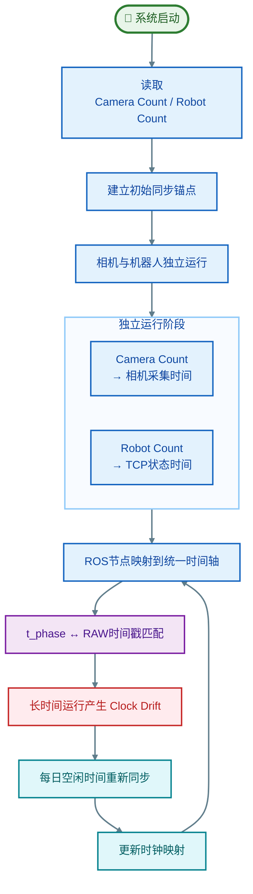

在机器人摆弧焊熔池视觉场景中，机械臂周期性摆弧运动导致的成像视角偏移，是制约熔池稳定观测的核心问题。传统逐帧运动补偿方案受限于FANUC等封闭工业机器人平台仅60Hz的TCP状态输出频率，存在严重的时间分辨率失配，插值重建的高频轨迹可信度不足。本文提出一种**基于运动先验与ISP后处理的系统架构重构方案**：通过将机械臂运动分解为慢变焊缝跟随分量与已知周期摆弧分量，**将全轨迹重建问题降维为关键相位时间估计问题**；进一步**将空间域图像补偿问题转化为时间域相位选帧问题**，通过解耦RAW采集与ISP处理，使传感器以200Hz高时间分辨率连续采集RAW数据，仅对匹配摆弧关键相位的少数帧执行完整ISP处理，最终实现同相位成像的熔池稳定观测。

---
## 一、问题本源：机器人- 视觉系统的时间分辨率失配
机器人摆弧焊熔池视觉系统的主要矛盾是**机器人运动状态、视觉采样速率与时间同步精度三者之间的系统性失配**。

在该系统中，工业相机固连于机器人末端法兰附近，随TCP（Tool Center Point，工具中心点）同步执行摆弧运动。对于视觉观测而言，图像中的目标运动包含两个耦合分量：
- 熔池自身的位置（待观测的真实信号）
- TCP摆弧运动导致的相机视角偏移（扰动分量）

系统的目标是消除后者的影响，获得稳定的熔池观测序列。

### 1.1 传统逐帧补偿方案的技术路径
针对此类运动扰动，最直观的技术路线是基于多源状态融合的逐帧运动补偿：
1. 实时读取机器人TCP位姿与视觉算法检测的熔池位置
2. 通过卡尔曼滤波（Kalman Filter）进行状态融合，估计熔池的真实空间位置
3. 对每一帧图像执行逆向几何变换，补偿相机运动带来的偏移

该方案在开放式伺服系统中具备可行性，但在FANUC等封闭工业机器人平台上，受到了底层接口的刚性约束。

### 1.2 刚性约束：机器人TCP状态的60Hz采样上限
FANUC控制器的对外接口相对封闭，无法像开放式伺服系统那样直接获取kHz级的伺服环运动状态。项目中通过逆向TCP通信协议读取`tool_pos`数据，实际有效更新频率仅约60Hz，对应采样周期约为：
$$ \Delta t_{robot} \approx \frac{1}{60} \approx 16.7\ \text{ms} $$

对于普通的机器人状态监控，60Hz的采样率足以满足需求；但对于高频视觉稳像，该速率与相机采样率存在显著的数量级失配：
- 相机成像帧率可达120 ~ 200Hz（采样周期5 ~ 8.3ms）
- 机器人TCP状态仅60Hz（采样周期16.7ms）

两者的时间采样粒度差异可直观表示为：
> 相机采样：●--●--●--●--●--●--●--●
> 机器人采样：●---------●---------●

若直接基于60Hz的TCP数据通过插值升频后进行逐帧卡尔曼融合，就是在**用低频采样重建未知的高频运动**。插值无法创造新的观测信息，最终的运动补偿精度会受到采样定理的严格限制，这是卡尔曼方案效果不佳的原因。

---
## 二、运动先验：机械臂摆弧运动的可分解性
突破低频采样约束的前提是**机械臂的摆弧运动并非完全未知的随机扰动，而是具有强结构化先验的受控运动**。

摆弧焊过程中TCP的整体运动可以分解为两个时间尺度、特性完全不同的分量，在焊缝局部坐标系下可表示为：
$$ p_{TCP}(t) = p_{seam}(t) + p_{weave}(t) $$

> 注：该分解并非严格的六自由度刚体运动向量叠加，而是在焊缝局部坐标系下对TCP平移运动的工程化拆解，适用于摆弧幅度远小于焊缝长度的典型焊接场景。

### 2.1 焊缝跟随运动：慢变未知分量
$p_{seam}(t)$ 代表机器人沿焊缝的整体运动与视觉纠偏分量，包含：
- 沿焊缝方向的持续进给运动
- 垂直焊缝方向的左右纠偏
- 高度方向的上下弧压纠偏

该分量的运动特征是**变化缓慢、无固定周期、需要通过观测实时估计**，属于系统中的未知慢变信号。

### 2.2 摆弧运动：已知结构化分量
$p_{weave}(t)$ 代表机器人控制器按照预设工艺参数执行的周期性摆弧运动，是系统主动输出的控制量，具备完整的先验信息：
- **周期已知**：摆弧频率由焊接工艺参数预先设定
- **振幅已知/可配置**：摆幅根据焊缝宽度预设
- **轨迹形式已知**：通常为正弦波、三角波、锯齿波或月牙形轨迹
- **相位连续**：机械臂伺服系统的运动具有连续性，相位不会突变

> 工艺背景：摆弧（Weaving）是厚板焊接中常用的工艺手段，通过焊枪沿焊缝垂直方向的周期性摆动，增大熔池受热面积，改善侧壁熔合效果，减少焊接缺陷。摆弧参数通常根据母材厚度、坡口形式提前确定，焊接过程中保持稳定。

这一运动分解是整个方案的基石：我们不需要用60Hz的低频采样去重建全部高频运动，只需要用实测TCP数据约束已知的摆弧运动模型，即可实现对关键运动状态的高精度估计。

---

## 三、问题降维：从全轨迹重建到关键相位时间估计
明确运动先验后，问题的求解目标可以进行第一次降维：我们不需要重建1kHz级的完整高精度TCP轨迹，只需要准确估计摆弧运动中关键相位对应的时间戳。

### 3.1 关键相位的定义
对于熔池稳像需求，最具价值的是摆弧的特征相位点，例如：
- 摆弧左右极值点（摆幅端点，满足 $\frac{dx_{weave}}{dt}=0$）
- 任意固定目标相位 $\phi(t)=\phi_{target}$

只要能在每个摆弧周期中精准找到该相位对应的时刻 $t_{peak}$，就能基于该时刻筛选图像。

### 3.2 估计的可信度支持
基于60Hz TCP数据估计关键相位时间，并非无依据的插值，而是**多约束下的模型化估计**，其可信度来源于：
1. **摆弧数学模型约束**：轨迹形式、周期、振幅范围已知
2. **运动连续性约束**：机械臂刚体运动的速度、加速度连续
3. **多观测点拟合**：利用前后多个连续TCP采样点共同拟合轨迹，而非单点判断
4. **慢变分量假设**：焊缝跟随运动在单个摆弧周期内变化极小，可近似为线性趋势

其本质是：低频真实观测 + 已知运动模型 + 连续性约束 → 关键运动相位的时间估计，这与单纯的低频插值升频有着本质的可信度差异。

### 3.3 为什么不做逐帧卡尔曼融合
需要明确的是：**关键相位时间估计的有效性**，不等于可以得到用于逐帧补偿的全精度高频TCP状态。

**逐帧运动补偿对状态估计的要求极高**，需要每个时刻的TCP位置、速度、时间延迟**都达到高精度**，且无法通过摆弧模型完全消除伺服跟踪误差、机械振动、通信时延抖动等非理想因素。而关键相位估计只需要保证特征事件的时间精度，问题约束更强，求解难度显著降低。

在60Hz TCP的硬件约束下，放弃全状态逐帧融合、聚焦关键相位时间估计，是符合现有条件的较好选择。

---

## 四、思路转换：从空间域补偿到时间域相位选帧
基于关键相位时间估计，我们可以对稳像问题进行第二次重构：将**空间域的逐帧图像补偿问题**，转化为**时间域的同相位帧选择问题**。

### 4.1 相位选帧稳像的原理
摆弧运动具有高度的周期性与可重复性，因此不需要对每一帧图像都做逆向运动补偿，**只需要在每个摆弧周期中，选择机器人处于同一运动相位时的图像帧即可**。

当采样相位固定时：
- TCP的摆弧偏移量近似相同
- 相机的空间位置与观察视角近似一致
- 熔池在图像中的相对位置近似稳定

其效果相当于从连续摆动的图像流中，“抽取出”一条空间状态一致的关键帧序列：

这是一种**基于运动相位的时间域稳像方法**，区别于传统的电子稳像（EIS）：它不对图像做任何几何变换与插值，不存在图像失真与特征匹配误差，尤其适合熔池这类低纹理、高动态的成像场景。

### 4.2 新的瓶颈：相机的时间采样分辨率
采用相位选帧方案后，系统的核心瓶颈从“机器人状态频率”转移到了“相机RAW数据的时间采样分辨率”。

机器人侧输出的是关键相位的时间戳 $t_{peak}$，相机侧需要从连续采集的图像流中找到时间最接近的帧，即：
$$ k^* = \arg\min_k |t_k - t_{peak}| $$

最终的相位匹配误差，很大程度上由相机的采样时间粒度决定：时间分辨率越高，可选的帧越密集，匹配误差越小。

以120Hz与200Hz为例：
- 120Hz采样周期约8.33ms，理想最大量化误差约4.17ms
- 200Hz采样周期为5ms，理想最大量化误差为2.5ms

帧率提升后，最大时间量化误差下降约40%。根据 $\Delta x \approx v \cdot \Delta t$，时间误差会线性转化为空间位置误差，因此提升RAW采样的时间分辨率，直接决定了最终的稳像精度。

> 这里需要明确：追求200Hz并非为了输出200FPS的可视化视频，而是为了获得200Hz的时间采样能力，用于更精准地匹配关键相位时刻。

---

## 五、架构重构：ISP后处理与采集-成像解耦
提升RAW时间采样率的最大障碍，是传统相机链路中ISP的位置与处理能力限制。

### 5.1 传统成像链路的瓶颈
传统工业相机的成像链路为串行结构：
$$ \text{Sensor} \rightarrow \text{RAW} \rightarrow \text{ISP} \rightarrow \text{最终图像} \rightarrow \text{Host} $$

ISP（图像信号处理器）承担了完整的图像质量处理流水线，通常包含：
- 黑电平校正（Black Level Correction）
- 坏点校正（Bad Pixel Correction）
- 增益与曝光调整
- 去马赛克（Demosaic）
- 伽马校正与色调映射（Gamma & Tone Mapping）
- 颜色校正（Color Correction）
- 降噪与锐化等图像增强

完整ISP流水线的计算量较大，当传感器RAW读出能力可达200Hz时，全链路ISP可能仅能支持120Hz的输出帧率。此时ISP不再仅仅是图像质量模块，而成为了高时间分辨率采样链路中的性能瓶颈。
>ISP相关的详细讲解可以去看博主的ISP系列文章
### 5.2 解决方案：采集与成像解耦
传统架构隐含了一个默认假设：采集一帧RAW就必须立即生成一帧最终图像。但在相位选帧场景中，绝大多数RAW帧最终都不会被使用，只有关键相位附近的少数帧才有成像价值。

因此，更合理的系统架构是**先采集、再选择、后处理**，将RAW采集与ISP处理解耦：
1. **全速率RAW采集**：Sensor以接近200Hz的最高速率连续采集RAW数据，存入RAW缓冲区，每帧附带精确时间戳
2. **关键帧时间匹配**：根据机器人侧输出的 $t_{peak}$，在RAW缓冲区中匹配时间最接近的关键RAW帧
3. **按需ISP处理**：仅对选中的关键RAW帧执行完整ISP流水线，输出最终熔池图像

### 5.3 ISP后处理
**将ISP从RAW采集的关键路径中移除**。

- 传统架构：ISP决定了系统的最高成像帧率，RAW采集受限于ISP能力
- 重构架构：RAW采集由传感器读出速度决定，ISP仅负责少数关键帧的后处理

通过这种架构重构，系统同时获得了两个收益：
- **高时间分辨率采样**：传感器可以跑满200Hz的RAW读出能力，保证相位匹配精度
- **更低的计算负载**：ISP仅处理约1/周期数的帧（例如5Hz摆弧下仅处理5帧/秒），大幅释放计算资源

---
## 六、双时间轴协同：机器人与相机的时序工作流

整个系统可以拆解为机器人状态时间轴与相机采集时间轴两条并行链路。两条链路不要求采样频率一致，而是通过统一时间基准下的时间戳建立关联，从而实现低频机器人状态与高频图像采集之间的时序协同。

主要涉及思路是：
**利用低频TCP观测与摆弧运动的周期先验，估计目标摆弧相位对应的关键时刻，再从高频RAW图像流中选择与该时刻最接近的真实采样帧。**

### 6.1 机器人侧：从低频TCP观测到关键相位时刻

FANUC机器人侧以约60Hz频率输出TCP位姿。由于这一频率明显低于相机采样频率，所以机器人侧的目标并不是逐帧提供精确位姿，而是利用有限的TCP观测和摆弧运动先验，估计或预测目标摆弧相位对应的事件时刻 $t_{phase}$。

工作流程如下：
**TCP状态采集**
以约60Hz频率读取FANUC控制器输出的 $tool_pos$，获得离散TCP位姿序列：
$$
\mathbf{p}(t_k),\qquad t_k=kT_r
$$
其中机器人状态采样周期约为：
$$
T_r \approx \frac{1}{60}\approx16.7\text{ ms}
$$

**运动趋势分离**
TCP运动可以近似理解为焊接前进运动与周期摆弧运动的叠加：
$$
\mathbf{p}*{TCP}(t) = \mathbf{p}*{seam}(t) + \mathbf{p}_{weave}(t)
$$
其中：

- $\mathbf{p}_{seam}(t)$：沿焊缝方向缓慢变化的运动分量；
- $\mathbf{p}_{weave}(t)$：具有明显周期性的摆弧运动分量。

通过去趋势、局部拟合或基于已知摆弧方向的投影，可以增强周期摆动特征。

**局部轨迹与相位估计**
根据最近一段TCP观测，结合摆弧周期、振幅和运动连续性，对摆动状态进行局部估计。
例如可使用周期模型：
$$
x_{weave}(t) = A\sin(\omega t+\phi)
$$
或使用局部二次曲线对极值附近的数据进行拟合。

这里的拟合并不是认为机器人真实状态已经提升至200Hz，而是利用运动模型在两个60Hz观测点之间估计关键事件发生的大致时刻。

**关键相位时间估计**
根据系统需要定义目标摆弧相位，例如：

- 左侧极值；
- 右侧极值；
- 中心过零点；
- 某一固定摆弧相位。

对于极值点，可以根据：
$$
\frac{dx_{weave}(t)}{dt}=0
$$
求得对应的关键时刻：$t_{phase}$。
由于 $t_{phase}$ 来自60Hz离散观测与运动模型估计，因此它本质上是一个带有时间不确定性的事件时间估计值，其**精度受到TCP采样周期、通信抖动、时间戳误差以及摆弧模型误差的共同影响**。

**下一周期相位预测**
当摆弧周期 $T_w$ 较稳定时，可以利用当前已经检测到的关键事件预测下一次同相位事件：
$$
\hat t_{phase}^{(n+1)} = t_{phase}^{(n)} + T_w
$$

因此系统可以由“事件发生后再寻找图像”进一步扩展为“提前预测下一次事件”，方便相机侧建立更加稳定的选帧机制。

### 6.2 相机侧：从高频RAW采样到同相位关键帧

相机侧与机器人侧采用不同的采样频率。
假设图像传感器以200Hz连续采集RAW图像，其采样周期为：
$$
T_c=\frac{1}{200}=5\text{ ms}
$$

相机侧不需要等待机器人状态后再触发采集，而是始终保持高速连续采样，从而保留更高的时间分辨率。

工作流程如下：
**连续RAW采集**
图像传感器以约200Hz连续输出RAW数据：
$$
I_{RAW}(t_0),I_{RAW}(t_1),I_{RAW}(t_2),\ldots
$$
每一帧都记录对应的采集时间戳：$t_i^{cam}$。
时间戳应尽可能靠近真实曝光时刻，而不是仅使用后续ROS回调或ISP完成时刻。

**RAW历史缓存**
相机侧维护一个滚动历史缓冲区，例如：
$$
\mathcal B = { (I_i,t_i^{cam}) }
$$
缓冲区只保留最近一段时间内的RAW帧，并持续写入新采集数据、淘汰过期数据。
这样即使机器人侧需要经过若干毫秒才能完成相位判断，相机侧仍然能够从历史缓存中回溯到对应时刻附近的真实RAW帧。
>实现方式：Multi-Chunk + Ring Buffer：每个 chunk 里放若干完整 RAW 帧，多个 chunk 再按环形方式循环使用
>逻辑窗口：最近200~250ms
>物理容量：64帧 
>目标是缓存200ms以上的数据，为了应对系统性jitter和适配存贮结构提高效率，实际存储64帧数据。多chunk提供吸收算法处理延迟的瞬时抖动，Ring_buffer有界长期循环存储

**统一时间基准**
为了在机器人 TCP 状态与相机 RAW 图像之间执行准确的时间匹配，机器人侧估计得到的关键相位时刻 $t_{phase}$ 与相机帧采集时刻 $t_i^{cam}$ 必须位于统一或经过校正的时间基准下：
$$
t^{robot}\longleftrightarrow t^{camera}
$$

理想情况下，可通过 PTP、硬件触发或统一硬件时钟 实现机器人与相机之间的高精度时间同步。但受限于实际设备接口与开发条件，系统无法直接建立硬件级统一时钟，因此采用了**基于设备内部计数器（count）的软件时间对齐机制**。

系统初始化时，同时记录相机与 FANUC 机器人当前的内部计数值，并建立一次同步锚点：
$$
C_{cam}^{0} \longleftrightarrow C_{robot}^{0} \longleftrightarrow t_{sync}
$$
其中，$C_{cam}^{0}$ 与 $C_{robot}^{0}$ 分别表示同步时刻相机和机器人内部的计数器值，$t_{sync}$ 为工控机侧记录的统一参考时间。

后续相机帧与机器人 TCP 数据在产生时均携带各自设备的内部 count。数据传递至 ROS 运算节点后，根据初始化建立的同步关系，将设备内部计数转换到统一的软件时间轴上，从而恢复数据原本对应的采集或状态时刻：
$$
C_{device} \rightarrow t_{device} \rightarrow t_{common}
$$

这样可以尽量避免网络传输、ROS 调度以及线程执行延迟直接污染原始测量时间，为后续
$$
\arg\min_i \left| t_i^{cam}-t_{phase} \right|
$$
的跨系统关键帧匹配提供统一时间依据。

**长时间运行下的时钟漂移**
实际连续运行测试中发现，系统运行约一周后，相机与 FANUC 的 count 对应关系会逐渐发生偏移，使同一物理时刻下两侧恢复出的时间戳无法继续准确对齐。

该现象主要来源于两个设备内部硬件时钟的频率并不完全一致。即使初始化时两个时钟已经对齐，只要本地晶振存在微小频率偏差，其误差也会随运行时间持续累积：
$$
\Delta t_{clock}(t) = t^{camera}(t)-t^{robot}(t)
$$

理想情况下：
$$
\Delta t_{clock}(t)\approx0
$$
但实际设备中通常存在：
$$
f_{camera}\neq f_{robot}
$$
因此随着运行时间增加：
$$
|\Delta t_{clock}(t)| \uparrow
$$

也就是说，一次同步只能消除初始时钟偏移（clock offset），无法消除由硬件计时频率差异产生的长期时钟漂移（clock drift）。

为此，在任务管理模块中增加了**周期性重新同步机制**：系统每天选择设备处于空闲、不会影响正常采集任务的时间窗口，重新读取相机和机器人当前 count，并建立新的同步锚点：
$$
C_{cam}^{k} \longleftrightarrow C_{robot}^{k} \longleftrightarrow t_{sync}^{k}
$$

通过周期性重新校准两套本地时钟之间的映射关系，将长期累积的时钟漂移限制在允许范围内。

因此，系统实际采用的时序流程：

需要注意的是，该方案本质上属于软件级时间校准与漂移补偿，其最终时间精度仍会受到设备内部计数器分辨率、晶振稳定性、同步操作本身的时延以及软件调度抖动等因素影响。因此系统设计的目标并非实现严格意义上的硬实时全局时钟，而是在现有硬件条件下，使机器人关键相位时间与相机 RAW 采集时间保持足够稳定的对应关系，以满足摆弧关键帧筛选与熔池图像稳像需求。

**关键帧时间匹配**
当获得目标相位时刻 $t_{phase}$ 后，在RAW缓存中寻找时间距离最小的实际采样帧：
$$
i^* = \arg\min_i \left| t_i^{cam}-t_{phase} \right|
$$
选中的RAW帧为：
$$
I_{key} = I_{RAW}(t_{i^*})
$$

对于200Hz相机，在不存在其他时间同步误差的理想条件下，仅由离散帧率产生的最近邻量化误差上界约为：
$$
\pm\frac{T_c}{2} = \pm2.5\text{ ms}
$$
实际系统总误差还需要叠加机器人相位估计误差、时钟同步误差以及曝光时间定义误差。

**关键帧ISP后处理**
对最终选中的关键RAW帧执行完整ISP：
$$
I_{RAW} \xrightarrow{ISP} I_{RGB}
$$
ISP链路包括：黑电平校正；去坏点；Demosaic；白平衡；色彩校正；Gamma；去噪与增强等。

与逐帧执行完整ISP相比，该方案将大量计算集中到真正需要的关键帧上，从而实现：
$$
\text{高频RAW采集} + \text{低频关键帧ISP}
$$

**同相位图像序列输出**
连续多个摆弧周期执行相同的关键相位选帧后，可获得：
$$
I_{key}^{(1)}, I_{key}^{(2)}, I_{key}^{(3)}, \ldots
$$
这些图像虽然来自不同摆弧周期，但对应近似相同的运动相位，因此相机相对于熔池的瞬时观察状态更加一致。

其效果相当于从连续摆动的图像流中“抽取”出一条相位一致的关键帧序列：

因此，原本由机械臂周期摆弧造成的强周期视觉运动，可以在输出图像序列中被显著抑制。

### 6.3 系统整体架构

最终系统形成两条不同频率、但共享时间基准的并行时间轴：

```mermaid
flowchart TB
    %% ================= 机器人时间轴 =================
    subgraph RT["机器人时间轴 — FANUC 控制器"]
        direction TB
        FANUC["FANUC 控制器<br/>约 60Hz tool_pos"]
        TCP["离散 TCP 位姿序列"]
        SEP["运动趋势分离"]
        SLOW["焊缝慢变分量"]
        SWING["周期摆弧分量"]
        MODEL["局部运动模型估计"]
        PHASE["关键摆弧相位检测"]
        TP["t_phase / t_peak"]

        FANUC --> TCP
        TCP --> SEP
        SEP --> SLOW
        SEP --> SWING
        SLOW --> MODEL
        SWING --> MODEL
        MODEL --> PHASE
        PHASE --> TP
    end

    %% ================= 统一时间基准 =================
    SYNC["统一时间基准"]

    %% ================= 相机时间轴 =================
    subgraph CT["相机时间轴 — Sensor 200Hz RAW"]
        direction TB
        RAW["Sensor 200Hz RAW"]
        TS["RAW + 采集时间戳"]
        BUF["滚动历史缓存"]
        MATCH["时间最近邻匹配<br/>i* = arg min &#124;t_cam(i) - t_phase&#124;"]
        KEY["关键 RAW 帧"]
        ISP["ISP 后处理"]
        STD["标准格式图像"]
        SEQ["同相位稳定熔池图像序列"]
        ALGO["视觉算法 / 人工观测"]

        RAW --> TS
        TS --> BUF
        BUF --> MATCH
        MATCH --> KEY
        KEY --> ISP
        ISP --> STD
        STD --> SEQ
        SEQ --> ALGO
    end

    %% ================= 跨时间轴同步 =================
    TP --> SYNC
    SYNC -->|对齐 t_phase / t_peak| MATCH

    %% ================= 样式 =================
    classDef robot fill:#E3F2FD,stroke:#1565C0,stroke-width:2px,color:#0D47A1;
    classDef cam fill:#FFF3E0,stroke:#EF6C00,stroke-width:2px,color:#E65100;
    classDef phase fill:#F3E5F5,stroke:#7B1FA2,stroke-width:2px,color:#4A148C;
    classDef sync fill:#E8F5E9,stroke:#2E7D32,stroke-width:3px,color:#1B5E20;
    classDef output fill:#FCE4EC,stroke:#C2185B,stroke-width:2px,color:#880E4F;

    class FANUC,TCP,SEP,SLOW,SWING,MODEL robot;
    class PHASE,TP phase;
    class RAW,TS,BUF,KEY,ISP,STD cam;
    class MATCH,SYNC sync;
    class SEQ,ALGO output;

    style RT fill:#F8FBFF,stroke:#90CAF9,stroke-width:2px,color:#0D47A1
    style CT fill:#FFF8F0,stroke:#FFCC80,stroke-width:2px,color:#E65100
    linkStyle default stroke:#607D8B,stroke-width:2px,color:#455A64
```

从系统层面看，该架构完成的是一次**空间补偿问题向时间选择问题的转换**：
$$
\boxed{ \text{逐帧估计机器人运动并进行图像空间补偿} }
$$
转化为：
$$
\boxed{ \text{估计关键运动相位} + \text{从高频真实图像流中选择同相位帧} }
$$

这样可以避免依赖低频FANUC TCP数据对每一帧图像进行高频运动重建，同时又充分利用200Hz相机本身提供的高时间分辨率。

最终系统真正提升的是图像采样时间分辨率，而不是机器人状态测量频率：
$$
\boxed{ 60\text{ Hz Robot State} \quad+\quad 200\text{ Hz RAW Sampling} \quad+\quad \text{Phase Estimation} \quad\Rightarrow\quad \text{Phase-consistent Image Sequence} }
$$

因此，这套架构的关键价值并不在于“把60Hz机器人数据插值成200Hz”，而在于：

**让低频机器人状态负责判断“什么时候值得看”，让高频相机负责保证“那个时刻真的有一帧图像被采下来”**。

---

## 七、误差分析与方案演进路径
当前方案是在特定硬件约束下的最优工程实现，仍存在多维度的误差来源，未来可随硬件能力提升持续演进。

### 7.1 当前方案的误差来源
最终的相位匹配与成像误差是多因素的叠加：
$$ e_{total} = e_{robot} + e_{model} + e_{comm} + e_{sync} + e_{camera} $$
- $e_{robot}$：60Hz TCP采样的量化误差与数据延迟
- $e_{model}$：摆弧数学模型与实际伺服执行轨迹的偏差
- $e_{comm}$：机器人与上位机的通信时延与时延抖动
- $e_{sync}$：机器人控制器与相机的时钟同步误差
- $e_{camera}$：相机RAW采样的时间量化误差与曝光时刻偏差

### 7.2 未来演进方向
当硬件接口条件升级后，该架构可以进一步向高精度逐帧补偿方向演进：
1. **高频伺服状态接入**：若能获取500Hz~1kHz的伺服环级机器人状态，可实现全时段高精度TCP轨迹估计
2. **精确时钟同步**：采用PTP（精确时间协议，IEEE 1588）实现机器人与相机的亚微秒级时钟同步，消除同步误差
3. **逐帧状态融合**：基于高频机器人状态与视觉观测，通过卡尔曼滤波或状态观测器实现逐帧运动补偿，获得全帧率稳定图像

届时，系统将从“相位选帧稳像”升级为“全速率融合稳像”，实现更高的观测自由度与精度。

---

## 八、思考：硬件约束下的系统设计方法论
回顾整个方案的推导过程，最有价值的不在于某个具体算法，而在于面对硬件约束时的系统设计思路。

### 8.1 拒绝参数内卷：向下挖掘系统约束
当逐帧卡尔曼融合效果不佳时，第一反应往往是调滤波参数、换更复杂的算法。但真正的根源在于底层硬件接口的信息不足——60Hz TCP采样无法支撑全高频运动重建。在被硬件限制的方向上持续优化算法，**本质是参数内卷，难以获得本质提升**。

### 8.2 利用领域先验：重新定义问题边界
工业场景的最大优势是具备大量领域先验知识。摆弧运动不是随机扰动，而是系统主动输出的结构化控制量。通过运动分解，将“未知高频运动”转化为“已知模型+慢变偏移”，大幅缩小了问题的求解空间。

### 8.3 降维求解：从空间补偿到时间选帧
将空间域的图像补偿问题，转化为时间域的关键帧选择问题，是一次典型的问题降维。它放弃了“每一帧都要稳”的通用目标，转而利用场景周期性，实现“每一周期选一帧稳的”，用更低的信息成本满足了核心观测需求。

### 8.4 架构重构：解耦采集与处理
ISP后处理的本质是架构创新：打破“采集即处理”的传统成像链路，将信息采集与价值生成解耦。传感器负责最高粒度地记录真实世界，系统先判断哪些时刻有价值，再按需投入计算资源成像。这种思路在工业视觉、高速检测等场景中具备广泛的借鉴意义。

---
## 总结
本文针对FANUC机器人摆弧焊熔池视觉的稳像难题，提出了一套基于运动先验与ISP后处理的系统架构方案。面对60Hz低频TCP状态的硬件约束，方案没有选择强行优化逐帧融合算法，而是通过运动分解、问题降维与架构重构三步，将问题转化为关键相位时间估计与高频RAW选帧，最终实现了熔池的稳定观测。

工业视觉系统的优化，不应仅局限于算法层面的参数调优，更应向上结合工艺场景的领域先验，向下深挖硬件系统的约束边界，通过重新定义问题与重构系统架构，在有限的硬件条件下实现最优的系统性能。
